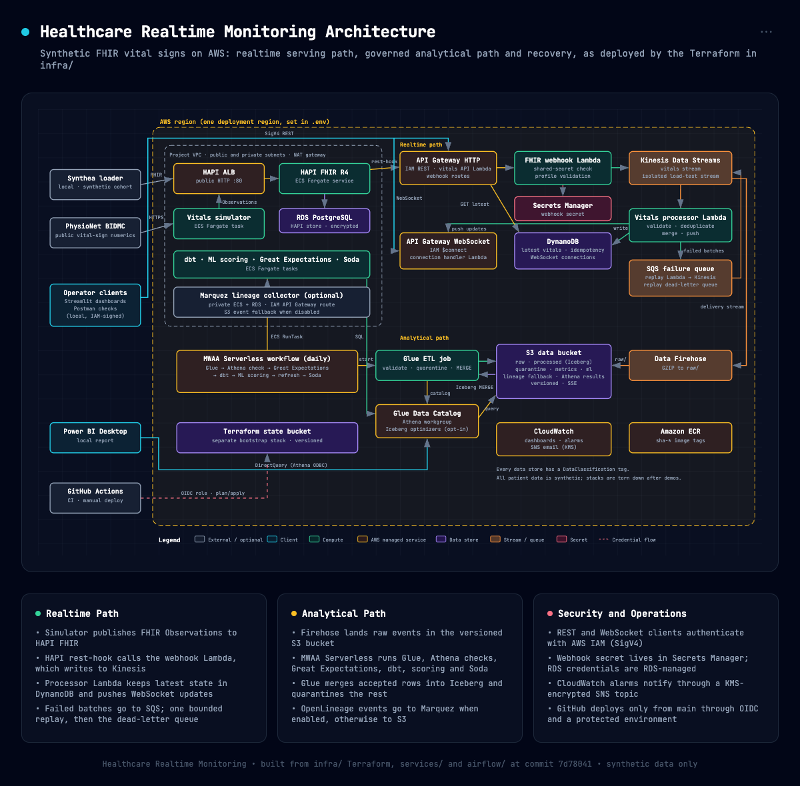

# Healthcare Realtime Monitoring

[](https://github.com/ian-mungai/healthcare-realtime-monitoring/actions/workflows/ci.yml)

An AWS portfolio project for synthetic realtime vital-sign monitoring. It ingests BIDMC waveform-derived measurements as FHIR observations, maintains current patient state for live clients and builds governed analytical datasets for quality validation and reporting.

This repository uses synthetic Synthea data and waveform-derived measurements for demonstration only. It is not a clinical decision-support system and must not be used for patient care.

## Table of Contents

- [Security](#security)
- [Background](#background)
- [Install](#install)
- [Usage](#usage)
- [Architecture](#architecture)
- [Data](#data)
- [Deploy and Teardown](#deploy-and-teardown)
- [Repository Layout](#repository-layout)
- [Limitations](#limitations)
- [Contributing](#contributing)
- [License](#license)

## Security

Public artifacts must use placeholders for account IDs, buckets, endpoints, load balancers, local usernames, secrets and signed headers. The project’s tracked examples are designed to be reproducible without revealing a deployed environment.

Do not commit secrets, deployment identifiers, Terraform state, signed headers or generated workflow definitions. Every commit runs the quality checks: gitleaks, blocks on credential and data files, lint and type checks, and a commit-message check for Conventional Commit subjects and AI attribution. CI runs the same hooks and scans the full Git history for secrets.

## Background

The project demonstrates a realtime and analytical healthcare data platform built end to end on AWS. Status: releases v1.0.0 and v1.0.1 are complete; the [v1.0.1 release notes](docs/release-notes-v1.0.1.md) summarize the current verified scope. The stack is torn down between demonstrations because it costs money while running.

### What It Demonstrates

- FHIR R4 observation ingestion through HAPI FHIR and a protected webhook.
- Kinesis-based realtime processing with latest-state delivery over IAM-authorized REST and WebSocket APIs.
- Separate Streamlit dashboards for live cohort monitoring and approved-model analytics.
- Durable normalized-event landing, Glue/Iceberg processing, Athena validation, dbt models, automated approved-model scoring, Soda contracts and OpenLineage events collected by IAM-protected Marquez or stored in S3.
- Bounded replay through encrypted SQS failure queues and a replay Lambda.
- Terraform-managed AWS infrastructure, CloudWatch dashboards, alarms and workload-scoped IAM roles.

## Install

### Prerequisites

- macOS or a compatible Unix shell
- Python 3.12
- Terraform 1.11 or later
- AWS CLI authenticated to the target account
- A temporary administrator or approved bootstrap identity for first deployment
- Docker, when building ECS images locally
- Java 17 and Gradle, when generating Synthea data
- Power BI Desktop and the Amazon Athena ODBC driver, only when reproducing the completed reporting connection

### Local Setup

Clone the repository and create a local Python environment:

```zsh
cd healthcare-realtime-monitoring
python3.12 -m venv .venv
.venv/bin/python -m pip install --upgrade pip
.venv/bin/python -m pip install -r requirements_dev.txt
.venv/bin/python -m tools.install_tools   # pinned gitleaks, tflint and checkov in .tools/
git config core.hooksPath .githooks          # pre-commit hooks and the commit-message check
```

Create the one ignored local configuration file:

```zsh
cp .env.example .env
```

Complete the placeholders in `.env`, then render both Terraform inputs:

```zsh
./scripts/infrastructure/render_project_config.sh
```

Stable project defaults live in `config/deployment.defaults.json`. The generated `infra/deployment.auto.tfvars.json` and `infra/bootstrap/deployment.auto.tfvars.json` files are ignored by Git and must not be edited by hand. Infrastructure and demo scripts treat `.env` as authoritative, so stale shell exports cannot silently change deployment configuration. Image tags are generated after ECR repository creation and recorded in `.env` by the publishing script. Verify the local toolchain and selected AWS identity after rendering. Cloud resources are checked in later deployment phases:

```zsh
./scripts/infrastructure/check_prerequisites.sh local
```

Load the ignored local environment before running AWS CLI, Terraform or dashboard commands:

```zsh
set -a
source .env
set +a
```

## Usage

### Validate the Repository

These commands mirror the local-CI checks in `.github/workflows/ci.yml`. Run `.venv/bin/pre-commit run --all-files` for the repository checks described in the quality checks guide:

```zsh
.venv/bin/python -m pytest tests scripts/synthea_loader/tests services/fhir_webhook/tests services/vitals_simulator/tests services/vitals_stream_processor/tests services/vitals_replay/tests services/vitals_api/tests services/websocket_handler/tests -q
.venv/bin/ruff check .
.venv/bin/ruff format --check .
.venv/bin/python -m mypy .
for contract in data_quality/soda/contracts/*.yml; do .venv/bin/soda contract test --contract "$contract"; done
PYTHONPATH="$PWD/airflow/serverless:$PWD/airflow/dags:$PWD" .venv/bin/python -m unittest discover -s airflow/serverless/tests -v
terraform -chdir=infra fmt -check -recursive
terraform -chdir=infra validate
```

### End-to-End Verification

E2E runs need a deployed environment. The [load-testing guide](docs/load-testing.md) runs the isolated Kinesis-to-DynamoDB-to-WebSocket test and prints its latency report to the terminal. The [demo guide](docs/demo-guide.md) and the [release checklist](docs/release-checklist.md) cover the full realtime and analytical path; verified results are recorded in the release notes.

### Run the Dashboards

After the target environment is deployed, launch the live cohort dashboard:

```zsh
./scripts/demo/start_live_dashboard.sh
```

Launch the separate model analytics dashboard in another terminal:

```zsh
./scripts/demo/start_model_analytics_dashboard.sh
```

The launch scripts load the selected AWS profile and region from `.env`. They retrieve realtime endpoints from Terraform outputs and analytical names from generated Terraform configuration. The live dashboard uses AWS IAM credentials to sign REST and WebSocket requests. The model dashboard queries Athena for probability-ranked approved-model scores, feature-window vital summaries, encounter context, freshness and governance labels.

### Demo and Operations

Use the [demo guide](docs/demo-guide.md) for a complete live walkthrough, including startup, dashboard validation, Postman REST and WebSocket checks, CloudWatch review and shutdown.

Use the [load-testing guide](docs/load-testing.md) to run an isolated test that measures Kinesis-to-DynamoDB processing and WebSocket delivery latency without writing test events into the analytical lakehouse.

## Architecture



The diagram source is [docs/architecture/architecture.html](docs/architecture/architecture.html). The [architecture guide](docs/architecture.md) describes the realtime path, analytical path, recovery model, security boundaries and observability design.

```text
Simulator -> HAPI FHIR -> webhook -> Kinesis -> Lambda -> DynamoDB -> REST/WebSocket -> live cohort dashboard
                                            \-> Firehose -> S3 -> Glue -> Athena -> dbt -> ML scoring -> model analytics dashboard
                                                                                         \-> Soda
```

## Data

| Source | Use | Classification | Terms of use |
| --- | --- | --- | --- |
| [Synthea](https://github.com/synthetichealth/synthea) v4.0.0 | Synthetic patients and encounters loaded into HAPI FHIR | Synthetic | Synthea software is Apache License 2.0 |
| [BIDMC PPG and Respiration Dataset](https://physionet.org/content/bidmc/1.0.0/) (PhysioNet) | De-identified waveform-derived heart rate, respiratory rate and SpO₂ readings replayed by the simulator | Public | Open Data Commons Attribution License v1.0; cite Pimentel et al., IEEE Transactions on Biomedical Engineering 64(8), 2016, and PhysioNet |
| Committed provider seed (`dbt/seeds/provider_history.csv`) | NPPES-compatible provider history for the type 2 provider dimension | Synthetic | Fictional clinicians created for this repository |

The simulator attaches BIDMC readings to synthetic Synthea patients, so every patient record in this project is synthetic. The analytical models label their rows `data_classification = 'synthetic'`.

The [data governance guide](docs/data-governance.md) documents datasets, schema controls, quality gates, deduplication, retention, replay and evidence expectations.

The [analytics star schema](docs/analytics-star-schema.md) defines the observation fact grain, conformed dimensions, key strategy, active-cohort and encounter-boundary rules and bus matrix.

The [model-training guide](docs/model-training.md) defines the inference-safe training windows and reproducible logistic-regression baseline. The [model-predictions guide](docs/model-predictions.md) covers daily approved-model scoring and Athena presentation datasets. The [Power BI connection guide](docs/power-bi-connection.md) documents the completed Athena connection. The local `.pbix` remains outside the repository and is not a release artifact.

The [technology inventory](docs/technology-inventory.md) lists the standards, AWS services, frameworks, libraries, delivery tools and testing methods used by the project.

The [v1.0.1 release notes](docs/release-notes-v1.0.1.md) summarize the current verified release scope, acceptance evidence and documented limitations. The [v1.0.0 release notes](docs/release-notes-v1.0.0.md) remain available as the initial release record.

## Deploy and Teardown

Start with the [first-deployment quickstart](docs/quickstart.md). It is the only complete command sequence for a fresh clone, account or region. Development and production run in separate AWS accounts; the [environments guide](docs/environments.md) explains how to select one. Terraform uses a protected S3 backend with native state locking and generated ignored inputs derived from `.env`.

The [deployment stages and recovery guide](docs/bootstrap.md) explains interrupted stages. The [infrastructure lifecycle guide](docs/infrastructure-lifecycle.md) covers state migration, guarded teardown, account retirement and recreation. The [external prerequisite inventory](docs/external-prerequisites.md) identifies account configuration outside the application stack. The [deployment guide](docs/deployment.md) covers GitHub OIDC and the optional shared OpenLineage collector. Recovery, cost control and operational checks are in the [operations runbook](docs/operations-runbook.md).

Tear the stack down after every demo. The guarded teardown runs in reviewed phases:

```zsh
./scripts/infrastructure/teardown.sh prepare-plan
./scripts/infrastructure/teardown.sh destroy-plan
```

Each apply phase requires `CONFIRM_TEARDOWN`; the full sequence, including storage cleanup and verification, is in the [infrastructure lifecycle guide](docs/infrastructure-lifecycle.md).

## Repository Layout

| Path | Contents |
| --- | --- |
| `infra/` | Terraform root and AWS service modules |
| `services/` | Webhook, realtime processor, API, replay, WebSocket and simulator services |
| `dashboard/` | Streamlit live cohort and model analytics clients |
| `jobs/` | Glue, dbt and machine-learning runtime jobs |
| `airflow/` | MWAA Serverless workflow source and generator |
| `dbt/` | dbt staging, dimensional and analytical models, seeds and tests |
| `data_quality/` | Great Expectations and Soda validation assets |
| `lineage/` | OpenLineage event emitters |
| `scripts/` | Build, test-data, load-test and demo helpers |
| `deploy/` | Container definitions for dbt, Soda and Marquez |
| `config/` | Shared vital-sign catalog and deployment defaults |
| `tests/` | Contract, infrastructure, lineage, dashboard and pipeline tests |
| `docs/` | Architecture, governance, operations, demo and Power BI connection documentation |

## Limitations

- All patient data is synthetic. Vital-sign values come from de-identified public recordings replayed onto synthetic patients; nothing here is real patient data.
- The deterioration label is a synthetic engineering proxy derived from NEWS2 extreme thresholds. The model is not clinically validated and must not be used for patient care.
- The portfolio environment keeps short log and backup retention to control cost. A production deployment would need formal retention, recovery, compliance and clinical-safety review.
- There is no live public demo, because the full AWS stack is billable while it runs.

## Contributing

Individual project; contributions are not accepted.

## License

[MIT](LICENSE) © 2026 Ian Mungai. Third-party data keeps its own terms; see [Data](#data).
