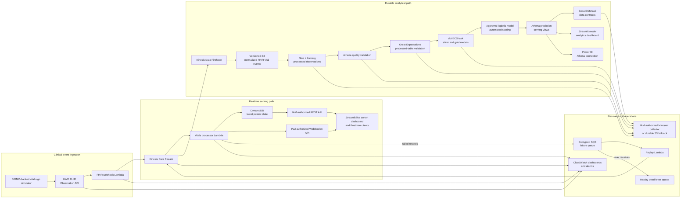

# Architecture

## Purpose

This portfolio project demonstrates an AWS-based healthcare monitoring platform using synthetic Synthea records and BIDMC waveform-derived vital signs. It is a technical demonstration, not a clinical system and not a source of patient-care decisions.

The design keeps three concerns distinct:

- low-latency patient-state delivery for monitoring clients;
- durable, governed analytical processing; and
- bounded failure recovery with observable operational controls.

## System overview



## Realtime path

1. The simulator converts synthetic cohort measurements into FHIR R4 `Observation` resources and submits them to HAPI FHIR.
2. The HAPI subscription invokes the webhook Lambda. The webhook validates its shared secret and publishes normalized events to Kinesis.
3. The processor Lambda validates realtime payloads, rejects stale or duplicate state updates, writes the newest state per patient to DynamoDB and broadcasts accepted updates to connected WebSocket clients.
4. The REST API provides an IAM-authorized latest-state fallback. The Streamlit dashboard uses the WebSocket feed while merging REST-polling results to remain responsive during a transient connection interruption.

The realtime serving model is deliberately cohort-first: the live dashboard keeps all simulated patients visible and permits an operator to focus on one patient without losing the wider clinical context.

## Analytical path

Kinesis Data Firehose writes immutable normalized vital events to the data bucket. These rows preserve FHIR identifiers and coding but are not complete FHIR resources. Glue reads that current event contract, classifies each measurement, exposes rejected rows through an Athena-readable quarantine table and deduplicates and merges accepted measurements into an Iceberg table. Reviewed quarantine rows can be corrected and republished through the controlled replay utility. The native Airflow DAG and MWAA Serverless workflow coordinate Glue, Athena validation, Great Expectations, dbt, approved-model scoring, prediction refresh and Soda in sequence:

```text
raw event arrival -> Glue -> Athena -> Great Expectations -> dbt -> approved-model scoring -> prediction refresh -> Soda
```

dbt produces a keyed observation fact, conformed dimensions, fixed-window encounter features and separate training and prospective-scoring datasets. The daily workflow scores the latter with one explicitly approved immutable model, publishes predictions to the Terraform-owned catalog named by `ATHENA_ML_DATABASE`, rebuilds the serving views and then runs freshness-aware Soda contracts. The separate model analytics dashboard joins the latest approved score to patient, encounter and feature-window context. It displays ranked proxy probability, model controls, scoring freshness and explicit synthetic and nonclinical labels without affecting live monitoring priorities. The [analytics star schema](analytics-star-schema.md) defines the analytical grain, keys, join paths and bus matrix. Each executed analytical validation emits OpenLineage lifecycle events with a shared run identity. The managed collector runs Marquez on private ECS and RDS resources behind explicit IAM-authorized API Gateway routes. Emitters sign remote requests using temporary workload credentials; S3 remains the durable fallback when the collector is disabled.

## Failure and recovery model

The processor reports batch-item failures to an encrypted SQS queue. The replay Lambda retrieves the original Kinesis sequence range and republishes a bounded replay attempt. A message that exceeds the receive threshold moves to a separate replay dead-letter queue for operator investigation.

This design prefers controlled replay over blind redrive: an operator should identify the underlying data or deployment issue, inspect the dead-letter record and then validate fresh state, dashboard behavior and alarms after recovery. The full procedure is in [operations-runbook.md](operations-runbook.md).

## Security boundaries

- HAPI FHIR runs behind an application load balancer; the service and database remain in the project VPC.
- The webhook secret resides in AWS Secrets Manager and is retrieved at runtime. It is not embedded in Terraform configuration or public artifacts.
- REST and WebSocket clients authenticate with AWS IAM. Postman testing uses temporary authorization generated for the target environment.
- The Marquez service and database are private. Only SigV4-authenticated requests can traverse API Gateway to its internal load balancer.
- Workloads use narrowly scoped task and function roles. IAM policy templates require target account, region, bucket and alert values when rendered.
- The raw data bucket blocks public access, enables versioning and uses server-side encryption. Kinesis, SQS, DynamoDB recovery and encrypted failure queues protect the durable paths.

## Observability

Two CloudWatch dashboards support different questions. Resolve their deployed names from Terraform outputs instead of assuming an environment-specific name:

```zsh
terraform -chdir=infra output -raw cloudwatch_dashboard_name
terraform -chdir=infra output -raw realtime_observability_dashboard_name
```

| Dashboard | Operational focus |
| --- | --- |
| Pipeline observability output | End-to-end pipeline: Kinesis, Firehose, Glue, MWAA, dbt, Soda and analytical failures |
| Realtime observability output | Realtime state: processor errors, iterator age, processing latency, WebSocket delivery and simulator activity |

Alarms cover pipeline task failures, throttling, Firehose delivery, processor errors and throttles, iterator age, live processing latency, WebSocket-delivery failures, collector health, missing lineage events and client-side lineage-emission failures. Operational validation is complete only when current state advances, monitoring clients receive updates and the relevant alarms are `OK`.

## Deployment and configuration

Terraform owns the AWS infrastructure. A clone supplies target-specific configuration through one ignored local file:

```text
.env                                      target-specific inputs entered once
config/deployment.defaults.json           tracked stable project defaults
infra/deployment.auto.tfvars.json         generated application Terraform inputs
infra/bootstrap/deployment.auto.tfvars.json generated state-bootstrap inputs
```

The tracked `.env.example` contains placeholders only. The renderer derives shared settings such as patient access policy and the Terraform state prefix. Generated MWAA workflow definitions, Terraform state, secrets, endpoint identifiers and deployment-specific values remain local to the target environment. Setup and deployment checks are documented in [operations-runbook.md](operations-runbook.md).

## Trade-offs

- The project prioritizes explainable, observable AWS-native services over minimizing component count.
- The dashboards use synthetic data and are not regulated clinical systems; they do not replace certified monitoring or clinical decision-support tools.
- The portfolio environment retains short operational log and database-backup periods to control cost. A production deployment would require formal retention, recovery, compliance and clinical-safety review.
