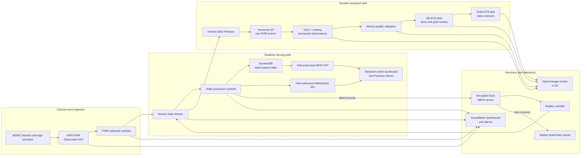

# Architecture

## Purpose

This portfolio project demonstrates an AWS-based healthcare monitoring platform using synthetic Synthea records and BIDMC waveform-derived vital signs. It is a technical demonstration, not a clinical system and not a source of patient-care decisions.

The design keeps three concerns distinct:

- low-latency patient-state delivery for monitoring clients;
- durable, governed analytical processing; and
- bounded failure recovery with observable operational controls.

## System overview



## Realtime path

1. The simulator converts synthetic cohort measurements into FHIR R4 `Observation` resources and submits them to HAPI FHIR.
2. The HAPI subscription invokes the webhook Lambda. The webhook validates its shared secret and publishes normalized events to Kinesis.
3. The processor Lambda validates realtime payloads, rejects stale or duplicate state updates, writes the newest state per patient to DynamoDB, and broadcasts accepted updates to connected WebSocket clients.
4. The REST API provides an IAM-authorized latest-state fallback. The Streamlit dashboard uses the WebSocket feed while merging REST-polling results to remain responsive during a transient connection interruption.

The serving model is deliberately cohort-first: the dashboard keeps all simulated patients visible and permits an operator to focus on one patient without losing the wider clinical context.

## Analytical path

Kinesis Data Firehose writes immutable raw events to the data bucket. Glue classifies, quarantines, deduplicates, and merges accepted measurements into an Iceberg table. The MWAA Serverless workflow coordinates Glue, Athena validation, dbt, and Soda in sequence:

```text
raw event arrival -> Glue processing -> Athena validation -> dbt build -> Soda contracts
```

dbt produces the staging, fact, and dimension models used for analytical reporting. Great Expectations validates the processed table independently; Soda validates the analytical contracts. Every major analytical step emits OpenLineage lifecycle events with a shared run identity where applicable.

## Failure and recovery model

The processor reports batch-item failures to an encrypted SQS queue. The replay Lambda retrieves the original Kinesis sequence range and republishes a bounded replay attempt. A message that exceeds the receive threshold moves to a separate replay dead-letter queue for operator investigation.

This design prefers controlled replay over blind redrive: an operator should identify the underlying data or deployment issue, inspect the dead-letter record, and then validate fresh state, dashboard behavior, and alarms after recovery. The full procedure is in [operations-runbook.md](operations-runbook.md).

## Security boundaries

- HAPI FHIR runs behind an application load balancer; the service and database remain in the project VPC.
- The webhook secret resides in AWS Secrets Manager and is retrieved at runtime. It is not embedded in Terraform configuration or public artifacts.
- REST and WebSocket clients authenticate with AWS IAM. Postman testing uses temporary authorization generated for the target environment.
- Workloads use narrowly scoped task and function roles. IAM policy templates require target account, region, bucket, and alert values when rendered.
- The raw data bucket blocks public access, enables versioning, and uses server-side encryption. Kinesis, SQS, DynamoDB recovery, and encrypted failure queues protect the durable paths.

## Observability

Two CloudWatch dashboards support different questions:

| Dashboard | Operational focus |
| --- | --- |
| `healthcare-realtime-monitoring` | End-to-end pipeline: Kinesis, Firehose, Glue, MWAA, dbt, Soda, and analytical failures |
| `healthcare-realtime-live-development` | Realtime state: processor errors, iterator age, processing latency, WebSocket delivery, and simulator activity |

Alarms cover pipeline task failures, throttling, Firehose delivery, processor errors and throttles, iterator age, live processing latency, and WebSocket-delivery failures. Operational validation is complete only when current state advances, monitoring clients receive updates, and the relevant alarms are `OK`.

## Deployment and configuration

Terraform owns the AWS infrastructure. A clone supplies target-specific configuration through ignored local files and environment variables:

```text
infra/development.tfvars        target region, unique bucket names, alert address, image tags
.env                            local dashboard and integration configuration
AWS_PROFILE / AWS_REGION        active AWS CLI and SDK context
```

Tracked examples contain placeholders only. Generated MWAA workflow definitions, Terraform state, secrets, endpoint identifiers, and deployment-specific values remain local to the target environment. Setup and deployment checks are documented in [operations-runbook.md](operations-runbook.md).

## Trade-offs

- The project prioritizes explainable, observable AWS-native services over minimizing component count.
- The dashboard is designed for synthetic-cohort monitoring, not regulated clinical use; it does not replace a certified bedside-monitoring system.
- The portfolio environment retains short operational log and database-backup periods to control cost. A production deployment would require formal retention, recovery, compliance, and clinical-safety review.
